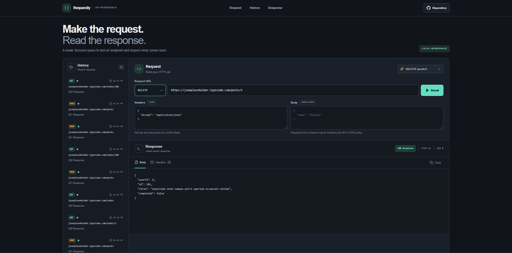

# API Request Workbench

Requestly is a browser-based REST client for composing HTTP requests and inspecting the response. It is intended for developers who need a quick way to test an endpoint, check response headers, and read a JSON or text payload.

**Live site:** [https://a2rp.github.io/api-request-workbench/](https://a2rp.github.io/api-request-workbench/)

## What is included

- A fixed header with navigation to the request composer, recent history, and response, plus a link to the source repository.
- HTTP methods for GET, POST, PUT, PATCH, and DELETE.
- Editable URL, request headers as a JSON object, and a request body for methods other than GET.
- An example request dropdown with GET, POST, PUT, PATCH, and DELETE presets. Selecting a preset fills the method, URL, headers, and body without sending it.
- A live response view with HTTP status, elapsed time, response size, formatted JSON or text, and response headers.
- Copy controls for the response body or response headers.
- A local history of the eight most recent requests. Selecting a history item restores its method, URL, headers, and body to the composer.
- A shared footer with source, profile, and support links, and a floating **Back to top** control after scrolling.

## How to send a request

Choose a request from the example dropdown to fill the method, URL, headers, and body, then press **Send** when you are ready. Changing the method dropdown also loads a matching example, so the URL and body stay in sync with GET, POST, PUT, PATCH, or DELETE. The presets include a GET for one to-do and create, replace, edit, and delete examples for posts. You can edit any populated field before sending. The response panel shows the status, time, size, body, and headers. Use the response tabs to switch between body and headers, then copy the visible content with **Copy**.

Request headers must be a JSON object such as `{"Accept":"application/json"}`. If a non-GET request has a body and no content type is set, the client uses `application/json` for valid JSON and `text/plain` otherwise. This app uses `fetch` directly in the visitor's browser. The target server must allow the request through its CORS policy; a browser CORS failure is shown as a request error.

## Saving and limits

The current request and up to eight history entries are stored in local storage under `requestly-workbench-v1`. Data stays in the current browser profile and does not sync to an account or a server. Clearing site data removes it. The sample URL is provided for convenience and depends on that service being available. Browser security restrictions, network availability, and the target API's CORS settings can prevent a request from completing.

## Run locally

Use Node.js and npm, then run these commands from this directory:

```sh
npm install
npm run dev
```

## Checks and deployment

```sh
npm run lint
npm run build
npm run deploy
```

The deploy command builds the app and publishes `dist` to the `gh-pages` branch. Vite uses `/api-request-workbench/` as its GitHub Pages base path.

## Future improvements

These are ideas and are not implemented yet:

- Add query parameter controls and reusable environment variables.
- Add request collections that can be imported and exported.
- Add response search and syntax highlighting for common formats.
- Add streaming support for server-sent events and large responses.

## Links

- Portfolio: [https://www.ashishranjan.net](https://www.ashishranjan.net)
- GitHub: [https://github.com/a2rp](https://github.com/a2rp)
- CodePen: [https://codepen.io/ash1198](https://codepen.io/ash1198)
- LinkedIn: [https://www.linkedin.com/in/aashishranjan](https://www.linkedin.com/in/aashishranjan)
- Facebook: [https://www.facebook.com/theash.ashish/](https://www.facebook.com/theash.ashish/)
- YouTube: [https://www.youtube.com/@ashishranjan-ashz?sub_confirmation=1](https://www.youtube.com/@ashishranjan-ashz?sub_confirmation=1)
- Email: [mailto:ash.ranjan09@gmail.com](mailto:ash.ranjan09@gmail.com)

## Support

- Support: [https://a2rp-donation-page.netlify.app/](https://a2rp-donation-page.netlify.app/)
- Buy Me a Coffee: [https://buymeacoffee.com/ashishranjan](https://buymeacoffee.com/ashishranjan)
- Patreon: [https://www.patreon.com/ashishranjan](https://www.patreon.com/ashishranjan)
